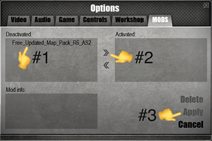

### Installation
1. Click the green `<> Code ▾` button and select the `Download ZIP option`.

1. Copy the `free-updated-map-pack-r6-as2-main` folder to your Men of War: Assault Squad 2 mods folder.

1. Apply `Free_Updated_Map_Pack_R6_AS2` in the `Options>Mods menu`.

4. ???
5. Profit! Haha 😂

### Changelog
🟦 Snipers, Teal
 - Snipers are teal
 - Sniper rifles are teal 
 - On mouse hover shows sniper in teal
 - Kill-feed shows sniper kills in teal 
 - Sniper shot makes custom sound
>Note: Veteran Snipers are yellow, since they share a skin with officers 
Note: U.S. Marines, Devils brigade, Spetsnaz, Shock infantry, Jaegers, and Sabatours are in teal, since they share a skin with snipers

🟪 AT Infantry, Magenta
 - AT weaponry are magenta
 - On mouse hover shows AT weaponry in magenta 
 - Kill-feed shows AT weaponry kills in magenta

🟨 Officers, Yellow
 - Officers are yellow
 - On mouse hover shows officer in yellow
 >Note: Veteran Snipers are yellow, since they share a skin with officers

🟥 Flare Gun, Red
 - Flare gun and radio packs are red
 - On mouse hover shows flare gun user in red

🟩 Flamethrower, Green
 - Flamethrower and flamethrower tank are green
 - On mouse hover shows flamethrower user in green

🟧 Miscellaneous, Orange
 - AT-rifles are orange 
 - On mouse hover shows AT-rifle user in orange
 - Kill-feed shows AT-rifle kills in orange
 - Kill-feed shows knife kills in orange
 - Machine guns are orange
